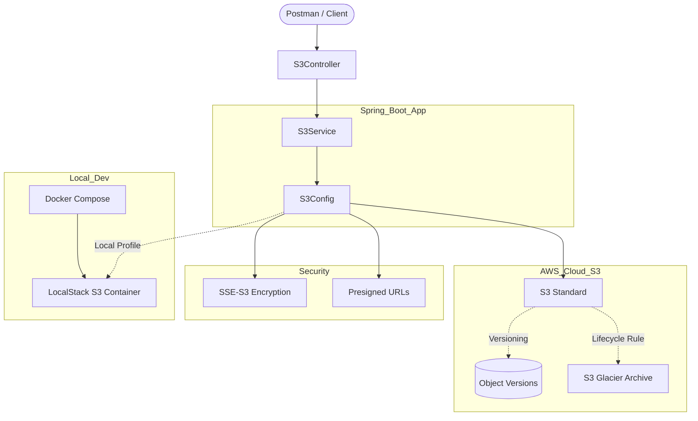

# S3 Masterclass: Spring Boot & AWS S3 Interview Prep

This project is a comprehensive guide and implementation of AWS S3 using Spring Boot 3 and AWS Java SDK v2. It is designed to demonstrate everything from basic CRUD to advanced enterprise patterns.

## 🏗 Architecture Diagram

## 🚀 Key Features Implemented

### 1. Bucket Management
*   **Create Bucket**: Programmatic bucket creation with unique naming.
*   **List/Delete**: Administrative endpoints for bucket lifecycle.

### 2. Advanced Upload Patterns
*   **Multipart Upload**: Optimized for large files (>100MB). Parallel uploads of byte-chunks with error recovery.
*   **SSE-S3 Encryption**: Every upload is automatically encrypted using AES-256 managed keys.
*   **Object Tagging**: Meta-data tagging for granular billing and access control.

### 3. Data Protection & Security
*   **Versioning**: Protection against accidental deletion. Every change creates a new `VersionId`.
*   **Presigned URLs**: Secure, temporary access to private objects without requiring AWS credentials from the client side.

### 4. Cost Optimization
*   **Lifecycle Policies**: Automated transition of "warm" data (S3 Standard) to "cold" storage (Glacier) after 30 days.

### 5. Local Development Excellence
*   **LocalStack Integration**: Full S3 API simulation using Docker.
*   **Environment Portability**: Seamlessly switch between LocalStack and Real AWS using environment variables.

---

## 🎓 Interview Deep-Dive: Feature Explanations

### 1. Bucket Operations
*   **What it is**: Fundamental containers for data.
*   **Interview Pointer**: Explain **Global Uniqueness**. Bucket names are shared across all AWS accounts globally. Mention **Region Selection**—buckets are region-specific, and data never leaves that region unless replicated.

### 2. Standard Object CRUD
*   **What it is**: High-level APIs for Put, Get, List, and Delete.
*   **Interview Pointer**: S3 is **Object Storage**, not a file system. Objects are immutable; "editing" a file actually creates a new object (managed via Versioning).

### 3. Multipart Upload (Critical for Interviews)
*   **What it is**: Splitting a large file into parts and uploading them independently.
*   **Interview Pointer**: If an upload fails at 90%, you only retry the failed 5MB part, not the whole 1GB. It improves **Parallelism** and **Throughput**.

### 4. S3 Versioning
*   **What it is**: Protecting data from accidental overwrites.
*   **Interview Pointer**: Deleting an object doesn't erase it; it adds a **Delete Marker**. To truly delete, you must delete the specific `VersionId`. Great for compliance.

### 5. Presigned URLs
*   **What it is**: Time-limited URLs that grant temporary access to private files.
*   **Interview Pointer**: Security best practice. Instead of making a bucket public, valid for e.g. 10 mins. The signature is generated using your IAM credentials server-side.

### 6. Lifecycle Management
*   **What it is**: Automating cost savings.
*   **Interview Pointer**: Move data from **S3 Standard** to **S3 Glacier** after 30 days. Perfect for logs or backups that aren't accessed frequently.

### 7. Server-Side Encryption (SSE-S3)
*   **What it is**: Data-at-rest encryption.
*   **Interview Pointer**: I implemented **SSE-S3** (AES-256). AWS S3 manages the keys for you. Essential for "Security in Depth" architecture.

### 8. Object Tagging
*   **What it is**: Key-Value metadata for objects.
*   **Interview Pointer**: Used for **Cost Allocation** (billing) and **ABAC** (Attribute-Based Access Control). E.g., "Allow only Finance users to read objects tagged `Dept: Finance`."

---

## 📚 S3 Interview Concepts (The "Perfect Answer" Guide)

### 1. What is S3?
- **Definition**: Simple Storage Service. It is **Object Storage** (not block/file storage).
- **Durability**: 99.999999999% (11 9's).
- **Availability**: Generally 99.99%.
- **Structure**: Buckets (containers) and Objects (files). Bucket names must be **globally unique**.

### 2. S3 Storage Classes (Crucial for Cost Optimization)
- **Standard**: Frequently accessed data.
- **Intelligent-Tiering**: Automatic cost savings for data with unknown access patterns.
- **Standard-IA (Infrequent Access)**: Cheaper, but has a retrieval fee.
- **One Zone-IA**: Cheaper than Standard-IA, but stored in only one AZ (lower resilience).
- **Glacier Instant Retrieval**: Low-cost, millisecond retrieval.
- **Glacier Flexible Retrieval**: Minutes to hours for retrieval.
- **Glacier Deep Archive**: Lowest cost, retrieval takes 12 hours.

### 3. S3 Data Consistency
- **Old Model**: Eventual consistency for overwrite PUTS and DELETES.
- **New Model (Since Dec 2020)**: **Strong Read-After-Write Consistency** for all operations (PUT, DELETE, LIST).

### 4. Security & Encryption
- **Bucket Policies**: JSON-based, bucket-level permission.
- **IAM Policies**: User-level permission.
- **Access Control Lists (ACLs)**: Legacy way to manage object-level permissions (mostly disabled now in favor of policies).
- **Encryption**:
    - **SSE-S3**: Keys managed by S3.
    - **SSE-KMS**: Keys managed by AWS KMS (audit trail available).
    - **SSE-C**: Keys managed by the Customer.
- **Public Access Block**: Account-level or Bucket-level safety switch to prevent public exposure.

### 5. Advanced Features
- **Versioning**: Each object gets a `VersionID`. Deleting an object creates a "Delete Marker". Prevents accidental data loss.
- **Lifecycle Rules**: 
    - **Transition Actions**: Move to cheaper storage after X days.
    - **Expiration Actions**: Delete objects after X days.
- **Multipart Upload**: Required for files > 5GB, recommended for files > 100MB. Improves throughput and handles network failures better.
- **Presigned URLs**: Temporary URLs (e.g., valid for 15 mins) to let users upload/download directly without AWS credentials.
- **Transfer Acceleration**: Uses AWS Edge Locations and CloudFront network for faster uploads.
- **S3 Select**: Retrieve only a subset of data from an object (CSV, JSON, Parquet) using SQL. Saves bandwidth.
- **CORS**: Cross-Origin Resource Sharing. Allows web apps in one domain to access S3 buckets in another.

### 6. Replication
- **CRR (Cross-Region Replication)**: For compliance/latency.
- **SRR (Same-Region Replication)**: For log aggregation or dev/test sync.
- *Note: Versioning must be enabled for replication.*

---

## 🛠 Setup
1. Update `src/main/resources/application.properties` with your AWS credentials.
2. Run the application: `./mvnw spring-boot:run`
3. Use Postman to hit the endpoints in `S3Controller`.

## 📝 Common Interview Questions
- **Q: How would you host a static website on S3?**
  A: Enable "Static Website Hosting" in bucket settings, upload `index.html`, and make the bucket public + add a bucket policy allowing `s3:GetObject`.
- **Q: Difference between S3 and EBS?**
  A: S3 is Object Storage (network-based, accessible via HTTP, unlimited). EBS is Block Storage (attached to EC2, formatted as a filesystem).
- **Q: What is a "Delete Marker" in S3?**
  A: When versioning is on, a simple DELETE request doesn't erase the file; it adds a delete marker. To truly delete, you must delete the specific version ID.
